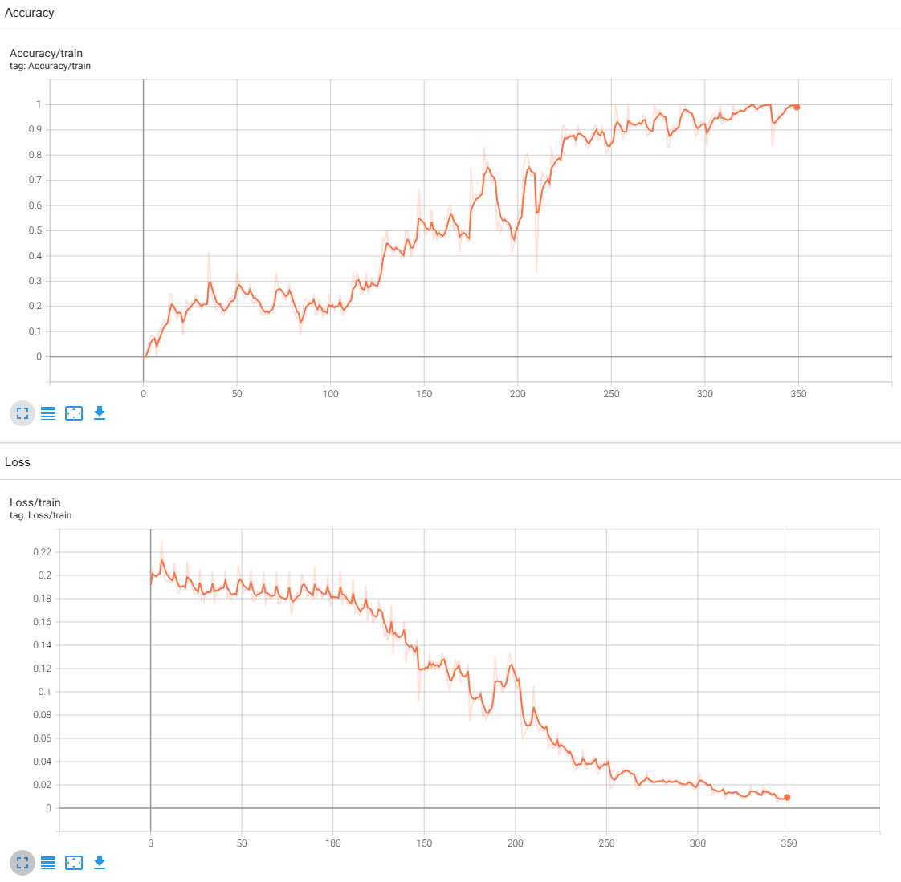
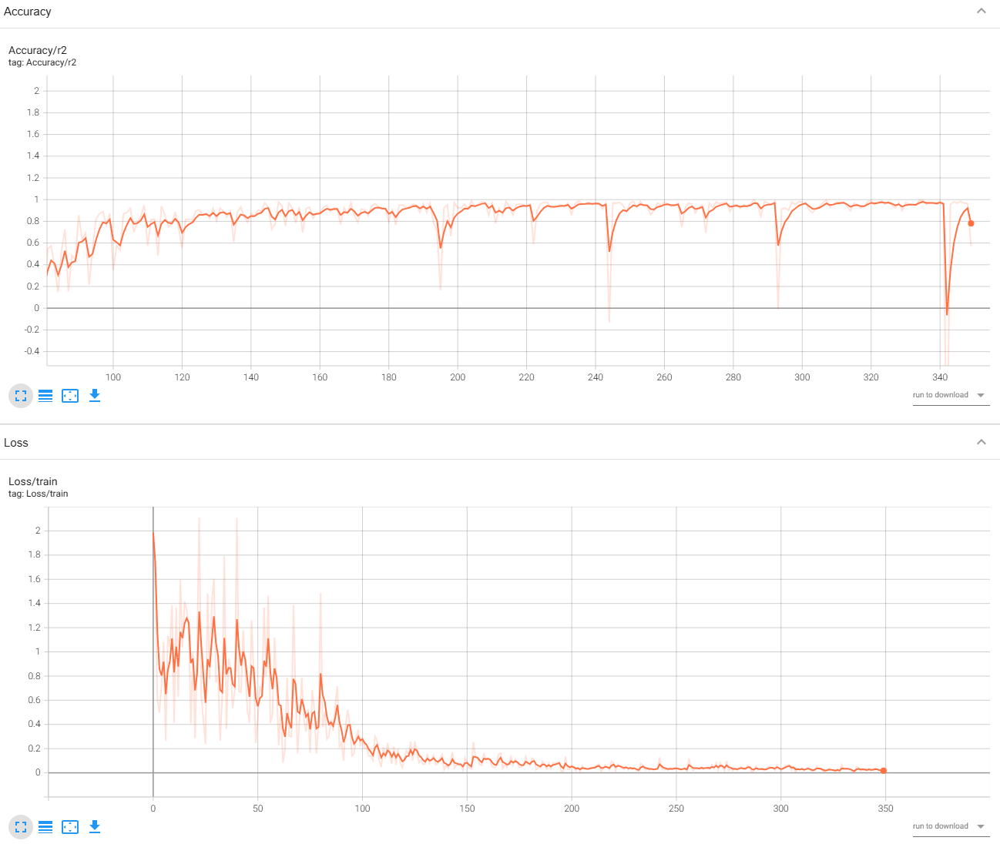

# Analisys of solving two problems:
### 1. Prediction of theme based on source code

### 2. Prediction of time running based on source code

    File buildSourceCodes.py construct dataset, based on source codes which are containted in the folder neetcode 
    File model.py contains two models (RobertaForClassification, RobertaForRegression) which are ancestors of the base model RobertaForSequenceClassification

